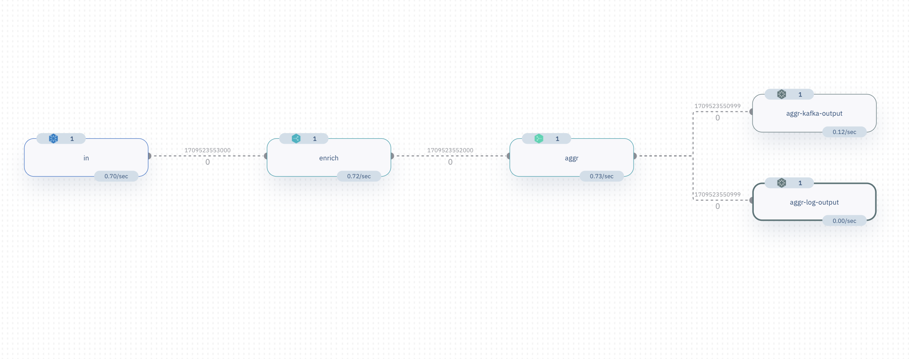

# Dooreats

This is a simple project to demonstrate how to use the [Numaflow](https://github.com/numaproj/numaflow) to analyze the order information of a food delivery app.

## Overview

The demo project simulates a food delivery app, it keeps generating order information, and streaming to a Kafka topic. A Numaflow pipeline is used to analyze the order information, enrich the data with restaurant information, dish prices, and then aggregate the data to calculate the total orders and the total revenue of each restaurant every N seconds. In the end, the aggregated data is sent to another data sink.

To display the aggregated data, a simple log sink is also used to visualize the data.

The original order information looks like this:

```json
{
  "id": "order-1709279048525074000-594",
  "restaurant_id": "rstt-003",
  "order_time": "2024-02-29T23:44:08-08:00",
  "dishes": [
    {
      "dish_id": "rstt-003-d003",
      "quantity": 1
    },
    {
      "dish_id": "rstt-003-d002",
      "quantity": 1
    }
  ]
}
```

After enrichment, the data looks like below, the `restaurant_name` and `price` fields are added to the original data:

```json
{
  "id": "order-1709279048525074000-594",
  "restaurant_id": "rstt-003",
  "restaurant_name": "Paesano Ristorante Italiano",  -- Added
  "order_time": "2024-02-29T23:44:08-08:00",
  "dishes": [
    {
      "dish_id": "rstt-003-d003",
      "price": 15.95,                                -- Added
      "quantity": 1
    },
    {
      "dish_id": "rstt-003-d002",
      "price": 21.95,                                -- Added
      "quantity": 1
    }
  ]
}
```

In the end, the aggregated data looks like below (group by restaurant every 60 seconds):

```json
{
  "start": "2024-03-04T03:49:00Z",
  "end": "2024-03-04T03:50:00Z",
  "restaurant_name": "Paesano Ristorante Italiano",
  "order_count": 3,
  "total_amount": 83.75
}
```

```json
{
  "start": "2024-03-04T03:49:00Z",
  "end": "2024-03-04T03:50:00Z",
  "restaurant_name": "Le Papillon",
  "order_count": 6,
  "total_amount": 138.39
}
```

```json
{
  "start": "2024-03-04T03:49:00Z",
  "end": "2024-03-04T03:50:00Z",
  "restaurant_name": "Jack's Restaurant & Bar",
  "order_count": 4,
  "total_amount": 176
}
```

## Pipeline



## Installation

To run the demo project, you need to have a Kubernetes cluster and the `kubectl` command line tool installed. Then you can install the project by running the following commands.

```bash
# Install Numaflow if you haven't
kubectl apply -n numaflow-system -f https://github.com/numaproj/numaflow/releases/download/v1.1.6/install.yaml

# Install the ISB Service
kubectl apply -f https://raw.githubusercontent.com/numaproj/numaflow/stable/examples/0-isbsvc-jetstream.yaml

# Install a Kafka service
kubectl apply -f https://raw.githubusercontent.com/numaproj/numaproj-demo/main/dooreats/manifests/kafka.yaml

# Install the data analysis pipeline
kubectl apply -f https://raw.githubusercontent.com/numaproj/numaproj-demo/main/dooreats/manifests/pipeline.yaml

# Install the order info generator
kubectl apply -f https://raw.githubusercontent.com/numaproj/numaproj-demo/main/dooreats/manifests/order-gen.yaml
```

## UI

```bash
kubectl -n numaflow-system port-forward svc/numaflow-server 8443
```

Access the UI at https://localhost:8443 to see the pipeline running.
